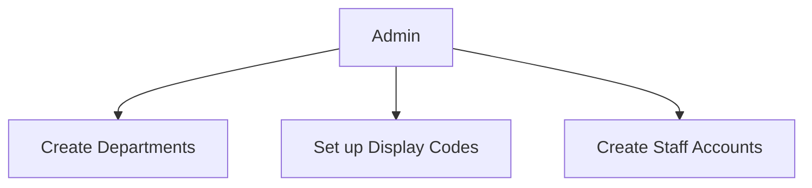
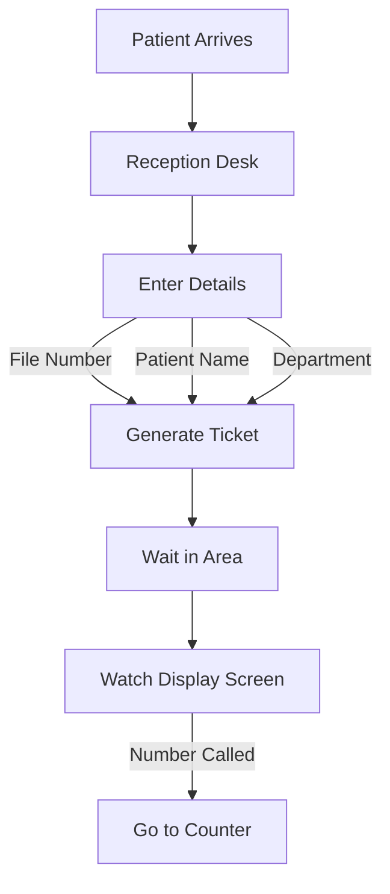
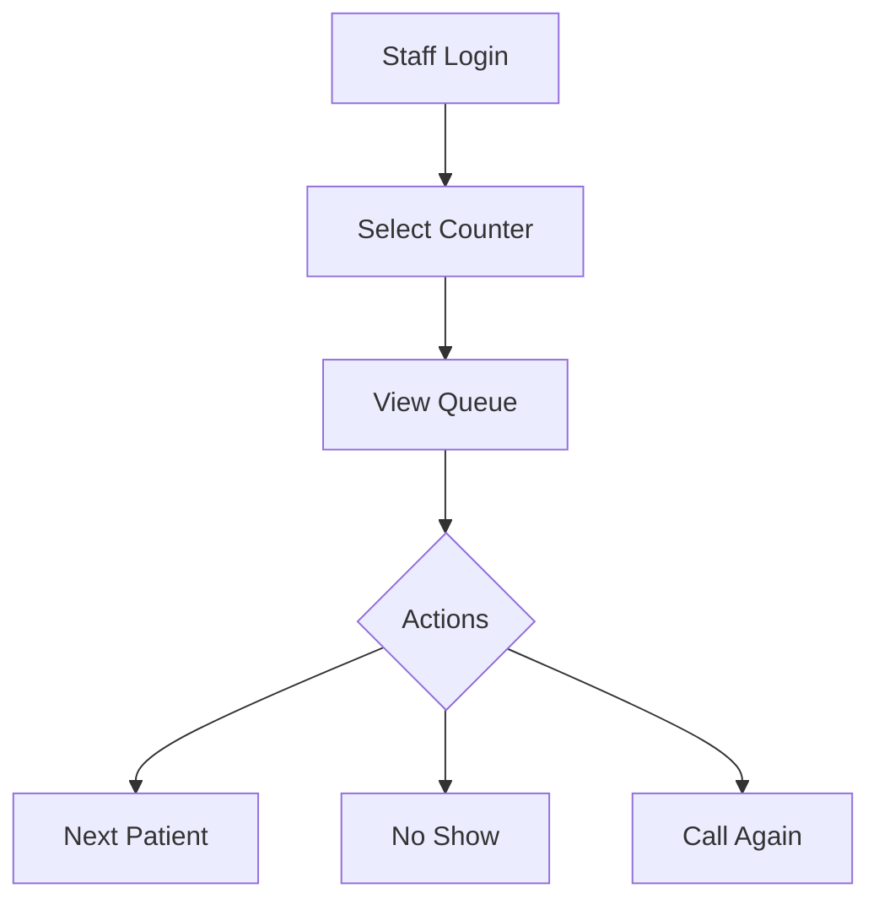
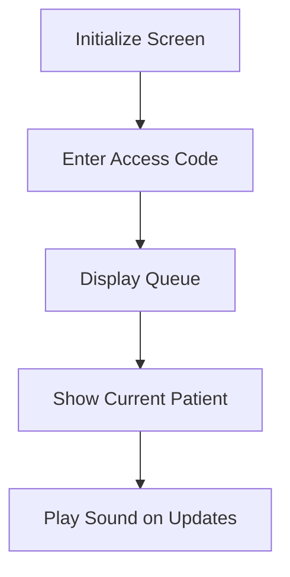
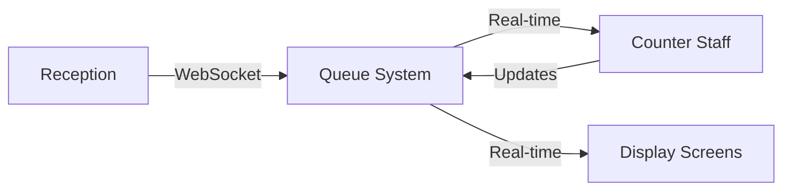

# Queue System Development Log

## Initial Setup (January 31, 2025)

### 1. Project Structure Creation

-   Created initial project structure
-   Set up core configuration files
-   Established documentation in `/docs`

### 2. Dependencies Installation

```bash
# Core NestJS packages
@nestjs/common@11.0.6
@nestjs/config@4.0.0
@nestjs/core@11.0.6
@nestjs/jwt@11.0.0
@nestjs/platform-express@11.0.6
@nestjs/platform-socket.io@11.0.6
@nestjs/swagger@11.0.3
@nestjs/typeorm@11.0.0
@nestjs/websockets@11.0.6

# Database & Cache
typeorm@0.3.20
pg@8.13.1
redis@4.7.0

# Utilities
bcryptjs@2.4.3
bull@4.16.5
class-transformer@0.5.1
class-validator@0.14.1
winston@3.17.0
reflect-metadata@0.2.2
socket.io@4.8.1

# Dev Dependencies
@types/bcryptjs@2.4.6
@types/node@22.12.0
@types/socket.io@3.0.2
ts-node@10.9.2
typescript@5.7.3
```

### 3. Configuration Files Setup

1. **TypeORM Configuration** (`src/config/typeorm.config.ts`)

    - Set up database connection
    - Configured entities and migrations
    - Added logging and initialization

2. **Database Configuration** (`src/config/database.config.ts`)

    - Created TypeORM module options
    - Set up environment variable integration

3. **Environment Setup** (`.env`)

```env
# Database
POSTGRES_HOST=localhost
POSTGRES_PORT=5432
POSTGRES_DB=queue_system
POSTGRES_USER=postgres
POSTGRES_PASSWORD=test1234

# JWT
JWT_SECRET=c8d6b6d1a3f4e5b2a9c8d7e6f5a4b3c2d1e0f9a8b7c6d5e4f3a2b1c0d9e8f7
JWT_EXPIRES_IN=8h

# App
PORT=3000
```

### 4. Entity Definitions

Created the following entities:

-   `User` - User management
-   `Department` - Hospital departments
-   `Counter` - Service counters
-   `QueueEntry` - Queue management
-   `DisplayAccessCode` - Display screen access

### 5. Migration Setup

1. Configured migration scripts in `package.json`:

```json
{
	"scripts": {
		"typeorm": "typeorm-ts-node-commonjs",
		"migration:create": "npm run typeorm -- migration:create",
		"migration:generate": "npm run typeorm -- -d ./src/config/typeorm.config.ts migration:generate",
		"migration:run": "npm run typeorm -- -d ./src/config/typeorm.config.ts migration:run",
		"migration:revert": "npm run typeorm -- -d ./src/config/typeorm.config.ts migration:revert"
	}
}
```

2. Generated initial migration:

```bash
npm run migration:generate ./src/migrations/InitialSchema
```

-   Successfully created: `1738276871093-InitialSchema.ts`

### 6. Project Rules Setup

Created rules in `.cursor/rules/`:

-   `queue-system.ts` - Core rules and versions
-   `validation.ts` - Input validation rules
-   `config.ts` - Configuration rules

### 7. Authentication Setup (January 31, 2025 - 20:45 WIB)

1. **Installed Authentication Packages**

```bash
@nestjs/passport@11.0.5    # NestJS Passport integration
passport@0.7.0             # Authentication middleware
passport-jwt@4.0.1         # JWT strategy for Passport
@types/passport-jwt@4.0.1  # TypeScript definitions
```

2. **Created Auth Module Structure**

```
src/modules/auth/
├── dto/
│   └── login.dto.ts         # Login data validation
├── interfaces/
│   └── auth.interfaces.ts   # Type definitions
├── auth.controller.ts       # Login endpoint
├── auth.service.ts         # Authentication logic
├── auth.module.ts          # Module configuration
└── jwt.strategy.ts         # JWT validation
```

3. **Implemented Common Guards & Decorators**

```
src/modules/common/
├── decorators/
│   └── roles.decorator.ts   # Role-based access control
├── guards/
│   └── roles.guard.ts       # Role validation
└── interfaces/
    └── jwt-payload.interface.ts  # JWT structure
```

4. **Authentication Features**

-   JWT-based authentication
-   Role-based access control
-   Secure password handling with bcrypt
-   Swagger documentation for auth endpoints

### 8. Users Module Setup (January 31, 2025 - 20:45 WIB)

1. **Created Users Module Structure**

```
src/modules/users/
├── users.module.ts    # Module configuration with TypeORM integration
└── users.service.ts   # User data access service
```

2. **Implemented Features**

-   Repository pattern for User entity
-   User lookup by username for authentication
-   TypeORM integration for database access

3. **Module Integration**

-   Exported UsersService for Auth module
-   Connected with User entity
-   Set up dependency injection

### 9. Database Migration & Seeding Setup (January 31, 2025 - 21:40 WIB)

1. **Database Migration Success**

```bash
# Tables Created:
- users
- departments
- counters
- queue_entries
- display_access_codes
```

2. **Seed Module Implementation**

Files Modified:

-   ✅ src/modules/seed/seed.module.ts (new)
-   ✅ src/modules/seed/seed.service.ts (new)
-   ✅ src/app.module.ts (added SeedModule)
-   ✅ src/main.ts (added seed initialization)

Features Added:

-   Admin user creation (username: admin, password: admin123)
-   Basic departments (X-Ray, Laboratory, Pharmacy)
-   Counter setup (3 counters per department)
-   Automatic seeding on application startup

3. **Documentation & Rules Enhancement**

Files Modified:

-   ✅ .cursor/rules/commands.ts (added reminder system)
-   ✅ .cursor/rules/project-structure.ts (updated module structure)
-   ✅ docs/cursor-commands.md (new command reference)

Added Features:

-   Cursor command templates
-   File change triggers
-   Documentation reminders
-   Project structure validation

### 10. Development Scripts Setup (January 31, 2025 - 23:35 WIB)

Files Modified:

-   ✅ package.json
    -   Added development scripts
    -   Added production scripts
    -   Added build configuration

Added Scripts:

```json
{
    "start": "ts-node src/main.ts",         # Development server
    "dev": "ts-node-dev --respawn src/main.ts",  # Watch mode
    "build": "tsc",                         # Production build
    "prod": "node dist/main.js"             # Production server
}
```

Next Steps:

-   Install ts-node-dev for development
-   Test development server
-   Verify seed functionality
-   Check database entries

### 11. Configuration Updates (January 31, 2025 - 06:37 WIB)

Files Modified:

-   ✅ src/config/typeorm.config.ts

    -   Fixed entity imports
    -   Added DataSourceOptions type
    -   Improved initialization structure
    -   Added proper error handling

-   ✅ .env
    -   Changed port from 3000 to 5000 to avoid conflicts

Changes Made:

1. **TypeORM Configuration**

```typescript
// Updated entity imports
import {User} from "../entities/user.entity"
import {Department} from "../entities/department.entity"
// ... other entities

export const dataSourceOptions: DataSourceOptions = {
	// ... configuration
	entities: [User, Department, Counter, QueueEntry, DisplayAccessCode],
}
```

2. **Environment Updates**

```env
PORT=5000  # Changed to avoid port conflicts
```

Next Steps:

-   Restart server with new configuration
-   Verify database connections
-   Test entity registration
-   Continue with seed functionality testing

### 12. Entity Registration Fix (January 31, 2025 - 06:45 WIB)

Files Modified:

-   ✅ src/config/database.config.ts
    -   Added entity imports
    -   Replaced glob pattern with explicit entity list
    -   Fixed TypeORM metadata loading

Changes Made:

```typescript
// Changed from glob pattern to explicit imports
- entities: ["dist/**/*.entity{.ts,.js}"],
+ entities: [User, Department, Counter, QueueEntry, DisplayAccessCode],
```

Next Steps:

-   Verify entity registration
-   Test database connections
-   Continue with seed functionality
-   Add error handling for entity loading

### 13. Console Logging System (January 31, 2025 - 06:50 WIB)

Files Modified:

-   ✅ src/config/logger.config.ts (new)

    -   Added Winston logger configuration
    -   Set up daily rotating log files
    -   Configured timestamp format

-   ✅ src/main.ts

    -   Added console log interception
    -   Configured NestJS logger

-   ✅ package.json
    -   Added winston dependencies

Changes Made:

1. **Logger Configuration**

```typescript
export const consoleLogger = createLogger({
	// Daily rotating file configuration
	filename: "logs/console-%DATE%.log",
	datePattern: "YYYY-MM-DD",
})
```

2. **Console Output**

-   Logs will be saved in: `/logs/console-YYYY-MM-DD.log`
-   Includes timestamps and log levels
-   Rotates daily with 14-day retention

Next Steps:

-   Test logging system
-   Add error logging
-   Configure log rotation
-   Add log analysis tools

## Current Status

1. **Completed Tasks**

-   ✅ Database structure
-   ✅ Initial migration
-   ✅ Auth module setup
-   ✅ Seed module implementation
-   ✅ Documentation structure

2. **Pending Implementation**

-   ⏳ User management endpoints
-   ⏳ Admin DTO implementation
-   ⏳ Role-based access
-   ⏳ Department management

## Next Steps

1. Complete user module:

    - Implement create-admin.dto.ts
    - Add user management endpoints
    - Set up role validation

2. Test functionality:

    - Run seed process
    - Verify admin creation
    - Test department setup

3. Implement core features:
    - Department management
    - Counter assignment
    - Queue generation

## System Flow Documentation

### 1. Hospital Setup (Administrative)



### 2. Patient Journey



### 3. Staff Workflow



### 4. Display Screen System



### Real-time Data Flow



### Implementation Priorities

1. **Core Setup** ✅

    - Database structure
    - Entity relationships
    - Basic configuration

2. **Authentication System** ⏳

    - Staff login
    - Role-based access
    - JWT implementation

3. **Queue Management** 🔜

    - Queue generation
    - Department queues
    - Counter management

4. **Real-time Updates** 🔜

    - WebSocket setup
    - Display screen updates
    - Sound notifications

5. **Administrative Features** 🔜
    - Department management
    - Staff management
    - Display code management

## Next Implementation Steps

1. Review and run initial migration
2. Set up authentication module
3. Create queue management module
4. Implement WebSocket gateway
5. Develop display screen functionality

## Notes

-   Using PostgreSQL for database
-   Redis for caching and real-time features
-   Socket.IO for WebSocket implementation
-   Following NestJS best practices
