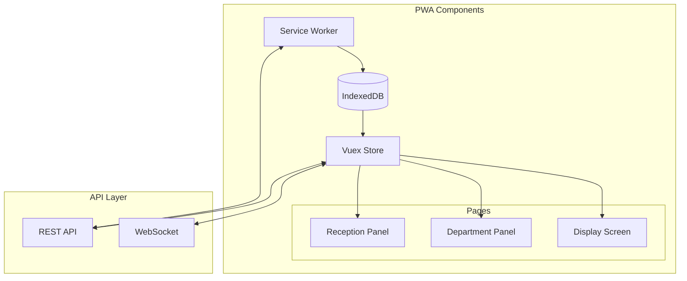
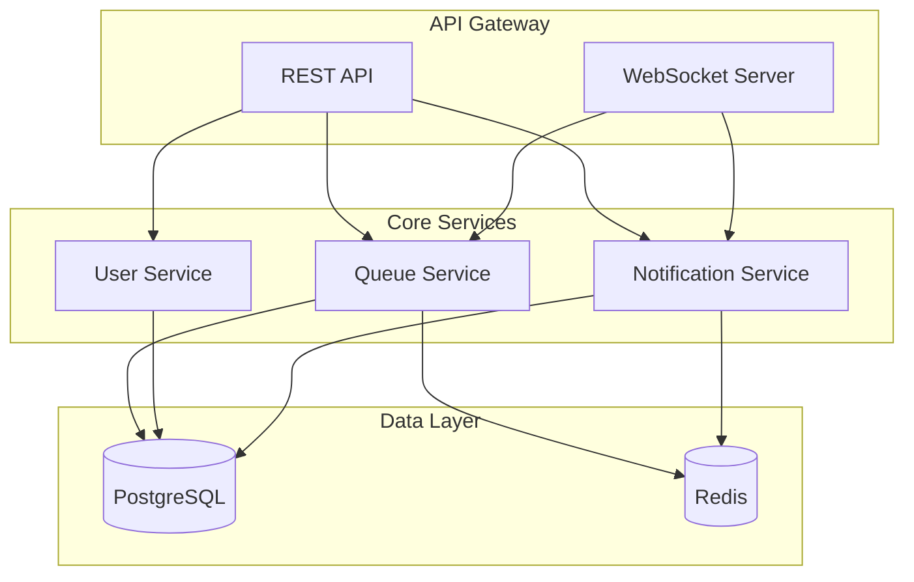

# Queue Management System - Technical Documentation

## System Overview

A real-time queue management system with offline support, implemented as a Progressive Web App (PWA) using Vue/Nuxt.

## Core Components

### 1. User Roles

```typescript
enum UserRole {
	RECEPTIONIST = "receptionist",
	COUNTER_STAFF = "counter_staff",
	ADMIN = "admin",
}

interface User {
	id: string
	username: string
	password: string // hashed
	role: UserRole
	departmentId: string // Required for COUNTER_STAFF
	counterId?: number // Set when staff selects counter
	isActive: boolean
	lastLogin: Date
}
```

### 2. Queue Management

```typescript
interface QueueEntry {
	id: string
	queueNumber: string // Format: [A-Z]-[000-999]
	fileNumber: string
	patientName: string
	departmentId: string
	counterId?: number
	status: QueueStatus
	createdAt: Date
	servedAt?: Date
	completedAt?: Date
	noShowAt?: Date
}

enum QueueStatus {
	WAITING = "waiting",
	SERVING = "serving",
	COMPLETED = "completed",
	NO_SHOW = "no_show",
}
```

## Architecture

### Frontend (Vue/Nuxt PWA)



### Backend Services



## Offline Support Implementation

### Frontend (Nuxt/Vue)

1. Service Worker Setup:

```javascript
// nuxt.config.js
{
  modules: [
    '@nuxtjs/pwa'
  ],
  pwa: {
    workbox: {
      offline: true,
      offlineStrategy: 'StaleWhileRevalidate',
      runtimeCaching: [
        {
          urlPattern: 'https://api.domain.com/.*',
          handler: 'NetworkFirst',
          method: 'GET'
        }
      ]
    }
  }
}
```

2. Offline Data Storage:

```typescript
// store/queue.ts
interface OfflineState {
	pendingActions: QueueAction[]
	localQueue: QueueEntry[]
	lastSyncTimestamp: number
}

// Actions to handle offline
export const actions = {
	async performAction({commit, state}, action: QueueAction) {
		try {
			await api.sendAction(action)
		} catch (error) {
			if (!navigator.onLine) {
				commit("addPendingAction", action)
				commit("updateLocalState", action)
			}
		}
	},

	async syncOfflineActions({commit, state}) {
		if (navigator.onLine) {
			for (const action of state.pendingActions) {
				try {
					await api.sendAction(action)
					commit("removePendingAction", action)
				} catch (error) {
					console.error("Sync failed:", error)
				}
			}
		}
	},
}
```

3. IndexedDB Structure:

```typescript
interface IDBSchema {
	queue: {
		key: string
		value: QueueEntry
		indexes: ["departmentId", "status"]
	}
	pendingActions: {
		key: string
		value: QueueAction
		indexes: ["timestamp"]
	}
	counterState: {
		key: number
		value: CounterState
		indexes: ["departmentId"]
	}
}
```

### Backend

1. Redis Cache Structure:

```typescript
interface RedisStructure {
	// Queue Management
	"queue:dept:{deptId}": QueueEntry[] // Active queue per department
	"counter:{counterId}:current": QueueEntry // Currently serving
	"counter:{counterId}:status": CounterState // Counter status

	// Offline Support
	"sync:client:{clientId}": SyncState // Client sync state
	"offline:actions:{clientId}": Action[] // Pending actions
}
```

2. Database Schema:

```sql
-- Users and Authentication
CREATE TABLE users (
    id UUID PRIMARY KEY,
    username VARCHAR(100) UNIQUE,
    password_hash VARCHAR(255),
    role VARCHAR(20),
    department_id UUID,
    counter_id INT,
    is_active BOOLEAN DEFAULT true,
    last_login TIMESTAMP,
    created_at TIMESTAMP DEFAULT CURRENT_TIMESTAMP,
    FOREIGN KEY (department_id) REFERENCES departments(id)
);

-- Departments
CREATE TABLE departments (
    id UUID PRIMARY KEY,
    name_en VARCHAR(100),
    name_ar VARCHAR(100),
    prefix CHAR(1),
    is_active BOOLEAN DEFAULT true
);

-- Counters
CREATE TABLE counters (
    id SERIAL PRIMARY KEY,
    department_id UUID,
    number INT,
    is_active BOOLEAN DEFAULT true,
    FOREIGN KEY (department_id) REFERENCES departments(id)
);

-- Queue Entries
CREATE TABLE queue_entries (
    id UUID PRIMARY KEY,
    queue_number VARCHAR(10),
    file_number VARCHAR(50),
    patient_name VARCHAR(100),
    department_id UUID,
    counter_id INT,
    status VARCHAR(20),
    created_at TIMESTAMP DEFAULT CURRENT_TIMESTAMP,
    served_at TIMESTAMP,
    completed_at TIMESTAMP,
    no_show_at TIMESTAMP,
    FOREIGN KEY (department_id) REFERENCES departments(id),
    FOREIGN KEY (counter_id) REFERENCES counters(id)
);

-- Counter Sessions (for tracking staff counter usage)
CREATE TABLE counter_sessions (
    id UUID PRIMARY KEY,
    user_id UUID,
    counter_id INT,
    start_time TIMESTAMP DEFAULT CURRENT_TIMESTAMP,
    end_time TIMESTAMP,
    FOREIGN KEY (user_id) REFERENCES users(id),
    FOREIGN KEY (counter_id) REFERENCES counters(id)
);
```

## API Endpoints

### Authentication

```typescript
POST   /api/auth/login
POST   /api/auth/logout
PUT    /api/auth/password

// Admin Only
POST   /api/admin/users
GET    /api/admin/users
PUT    /api/admin/users/:id
```

### Queue Management

```typescript
// Reception
POST   /api/queue/new
GET    /api/departments

// Department Panel
GET    /api/queue/:departmentId
PUT    /api/queue/:id/status
POST   /api/queue/:id/call
GET    /api/counters/:departmentId
POST   /api/counter/:id/select    // Staff selects counter
POST   /api/counter/:id/release   // Staff releases counter

// Display
GET    /api/display/:departmentId        // Get display data
POST   /api/display/token                // Generate display token (Admin only)
GET    /api/display/validate/:token      // Validate display token
GET    /api/display/:departmentId/status // Get department status
```

### WebSocket Events

```typescript
interface WSEvents {
	"queue:new": QueueEntry // New entry created
	"queue:update": QueueEntry // Status changed
	"queue:call": {
		// Audio call
		queueId: string
		counter: number
	}
	"counter:update": CounterState // Counter status change
	"sync:request": SyncRequest // Client sync request
}
```

## Offline Capabilities

### What Works Offline:

1. View current queue
2. Call next patient
3. Mark no-shows
4. Update patient status

### What Requires Online:

1. Creating new entries
2. Initial counter selection
3. Report generation
4. Admin functions

### Sync Process:

1. Client stores actions in IndexedDB
2. Background sync when online
3. Conflict resolution based on timestamps
4. Auto-retry failed syncs

## Frontend Guidelines for Vue/Nuxt Developer

1. PWA Setup:

    - Use @nuxtjs/pwa module
    - Configure workbox for offline
    - Implement app manifest

2. State Management:

    - Use Vuex for global state
    - Implement offline action queue
    - Handle WebSocket reconnection

3. Components Structure:

```
├── components/
│   ├── reception/
│   ├── department/
│   ├── display/
│   └── shared/
├── layouts/
├── pages/
│   ├── reception.vue
│   ├── department.vue
│   └── display.vue
├── store/
│   ├── queue.ts
│   ├── counter.ts
│   └── auth.ts
```

4. Offline Considerations:
    - Cache API responses
    - Queue mutations
    - Handle reconnection
    - Show offline status

## Security Considerations

1. Authentication:

    - JWT based
    - Token refresh mechanism
    - Session management

2. Authorization:

    - Role-based access
    - Department-level restrictions
    - Counter-level permissions

3. Display Screen Security:

    - No authentication required (public screen)
    - Display token system:
        ```typescript
        interface DisplayToken {
        	departmentId: string
        	screenId: string
        	expiresAt: Date
        }
        ```
    - Generate unique URL per screen:
        ```
        /display/:departmentId?token=xxx
        ```
    - Token validation for WebSocket connection
    - Rate limiting for display endpoints
    - IP-based access restrictions (optional)

4. Data Protection:
    - Encrypted storage
    - Secure WebSocket
    - XSS protection

## Monitoring & Logging

1. System Health:

    - WebSocket connections
    - Queue performance
    - API response times

2. Error Tracking:

    - Failed operations
    - Sync issues
    - Authentication failures

3. Analytics:
    - Queue metrics
    - Staff performance
    - System usage

Would you like me to expand on any section or add more specific implementation details?
