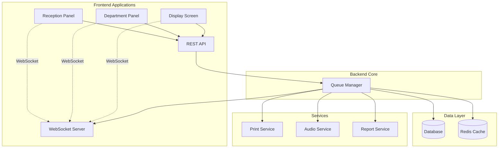

# Queue Management System Documentation

## Table of Contents
- [Authentication System](#authentication-system)
- [Overview](#overview)
- [System Components](#system-components)
- [Technical Architecture](#technical-architecture)
- [Implementation Details](#implementation-details)
- [API Documentation](#api-documentation)
- [Database Schema](#database-schema)
- [WebSocket Events](#websocket-events)
- [Reporting Features](#reporting-features)

## Overview

A multi-department queue management system designed for healthcare facilities, featuring real-time updates, multi-counter support, and Arabic language interface.

### Key Features
- Multi-department support
- Real-time queue updates
- Audio announcement system
- Bilingual support (Arabic/English)
- Custom reporting system
- Print ticket functionality

## System Components

### 1. Reception Panel
Web interface for creating new queue entries.

#### Data Structure
```typescript
interface QueueEntry {
    queueNumber: string;     // Format: [A-Z]-[000-999]
    fileNumber: string;
    patientName: string;
    departmentId: string;
    timestamp: Date;
    status: 'waiting' | 'serving' | 'complete' | 'no_show';
    counterId?: number;
}
```

#### Ticket Print Format
```typescript
interface TicketPrint {
    queueNumber: string;     // e.g., "R-1000"
    service: {
        english: string;
        arabic: string;
    }
    timestamp: string;
}
```

### 2. Department Panel
Interface for staff to manage queue entries.

#### Features
- Department-specific queue view
- Counter management
- Actions:
  * Serve (Start serving patient)
  * No Show (Mark as absent)
  * Call Again (Trigger audio)
  * Next (Complete current, call next)

### 3. Display Screen
Large format display for waiting area.

#### Display Format
- Main display:
  * Large queue number
  * Service name
  * Counter number
- Optional side panel for upcoming numbers

## Technical Architecture

### System Components Diagram


## Implementation Details

### Database Schema
```sql
CREATE TABLE departments (
    id VARCHAR(50) PRIMARY KEY,
    name_en VARCHAR(100),
    name_ar VARCHAR(100),
    prefix CHAR(1)  -- Queue number prefix (A, B, C, etc.)
);

CREATE TABLE counters (
    id SERIAL PRIMARY KEY,
    department_id VARCHAR(50),
    number INT,
    is_active BOOLEAN,
    FOREIGN KEY (department_id) REFERENCES departments(id)
);

CREATE TABLE queue_entries (
    id SERIAL PRIMARY KEY,
    queue_number VARCHAR(10),
    file_number VARCHAR(50),
    patient_name VARCHAR(100),
    department_id VARCHAR(50),
    counter_id INT,
    status VARCHAR(20),
    created_at TIMESTAMP,
    served_at TIMESTAMP,
    completed_at TIMESTAMP,
    FOREIGN KEY (department_id) REFERENCES departments(id),
    FOREIGN KEY (counter_id) REFERENCES counters(id)
);
```

## API Documentation

### Reception Endpoints
```typescript
POST   /api/queue/new        // Create new queue entry
GET    /api/departments      // List all departments
```

### Department Panel Endpoints
```typescript
GET    /api/queue/:departmentId          // Get department queue
PUT    /api/queue/:id/status             // Update entry status
POST   /api/queue/:id/call              // Trigger call system
GET    /api/counters/:departmentId      // Get department counters
```

### Display Endpoints
```typescript
GET    /api/display/:departmentId       // Get display data
```

## WebSocket Events

```typescript
interface WSEvents {
    'queue:new': QueueEntry;            // New entry added
    'queue:update': QueueEntry;         // Entry status changed
    'queue:call': {                     // Call announcement
        queueId: string, 
        counter: number
    };
    'display:update': DisplayData;      // Display update
}
```

## Reporting Features

### Available Reports
- Per staff/counter performance metrics
- Custom date range selection
- Key metrics:
  * Total patients served
  * Average service time
  * No-show count

### Report Access
- In-app reporting interface
- No external export required
- Real-time metrics calculation

## Authentication System

### User Roles
```typescript
enum UserRole {
    RECEPTIONIST = 'receptionist',
    COUNTER_STAFF = 'counter_staff',
    DEPT_ADMIN = 'dept_admin',
    SYSTEM_ADMIN = 'system_admin'
}

interface User {
    id: string;
    username: string;
    password: string; // hashed
    role: UserRole;
    departmentId?: string; // for department-specific roles
    counterId?: number;    // for counter staff
    isActive: boolean;
}
```

### Database Schema
```sql
CREATE TABLE users (
    id VARCHAR(50) PRIMARY KEY,
    username VARCHAR(100) UNIQUE,
    password_hash VARCHAR(255),
    role VARCHAR(20),
    department_id VARCHAR(50),
    counter_id INT,
    is_active BOOLEAN DEFAULT true,
    created_at TIMESTAMP DEFAULT CURRENT_TIMESTAMP,
    last_login TIMESTAMP,
    FOREIGN KEY (department_id) REFERENCES departments(id),
    FOREIGN KEY (counter_id) REFERENCES counters(id)
);
```

### Access Control Matrix
| Role           | Queue Actions                | Department Access    | Reports Access        |
|----------------|-----------------------------|--------------------|---------------------|
| Receptionist   | Create New                  | View Only         | None                |
| Counter Staff  | Serve, Call, No-Show        | Assigned Only     | Own Stats           |
| Dept Admin     | All + Manage Counters       | Own Department    | Department Stats    |
| System Admin   | All + Manage Users          | All Departments   | All Stats           |

### Authentication Endpoints
```typescript
POST   /api/auth/login           // Login
POST   /api/auth/logout          // Logout
PUT    /api/auth/change-password // Change password
GET    /api/auth/me              // Get current user

// Admin Only
POST   /api/admin/users          // Create user
PUT    /api/admin/users/:id      // Update user
GET    /api/admin/users          // List users
```

## Notes

1. **Internet Connectivity**
   - System should handle intermittent internet issues
   - Local caching for critical operations

2. **Queue Number Format**
   - Department specific prefix (A, B, C, etc.)
   - 3-digit sequential number
   - Example: A-001, B-002

3. **Language Support**
   - Interface: Arabic primary
   - Queue numbers: English format
   - Service names: Bilingual

4. **System Load**
   - Designed for ~1000 patients per day
   - 24/7 operation support
   - Multiple departments (5+)
   - Multiple counters per department (3-5)
